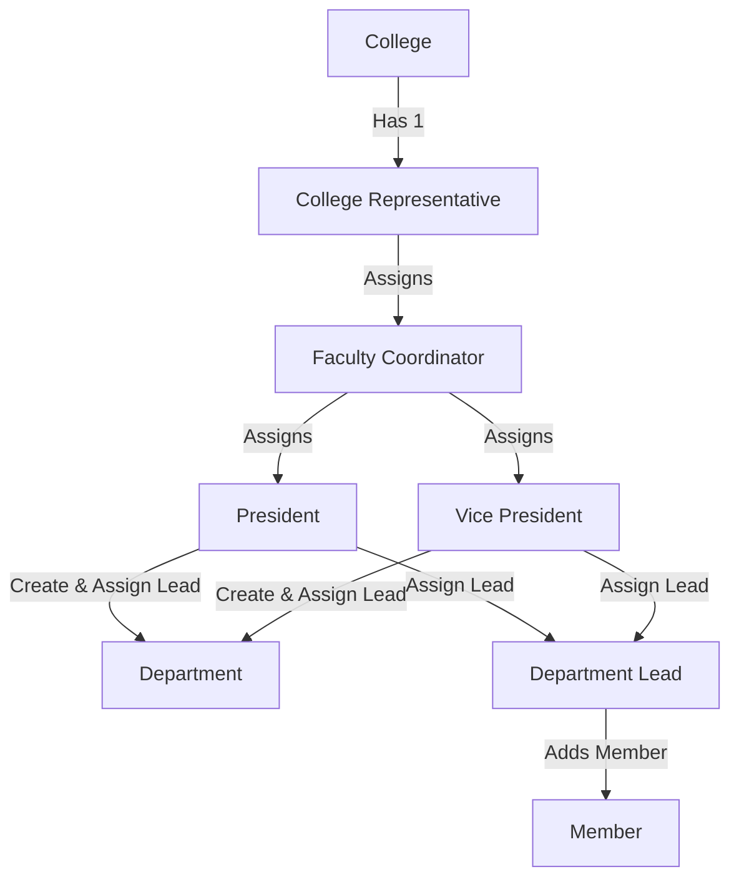

# TaskFlow Master Context

TaskFlow is a role-based platform designed to help colleges manage their clubs, and clubs manage their departments, tasks, and members through a structured, multi-level hierarchy.

---

## 1. System Hierarchy & Account Flow

TaskFlow supports standard public registration. Once accounts are created, roles, colleges, clubs, and departments are associated hierarchically.



### Roles and Flows:
1.  **College Representative (1 per College)**:
    *   Sits at the top of the college level.
    *   Creates/deletes clubs (e.g., up to 10 or more clubs in a college).
    *   Assigns **one Faculty Coordinator** per club.
2.  **Faculty Coordinator (1 per Club)**:
    *   Creates and assigns two roles: **President** and **Vice President**.
3.  **President & Vice President**:
    *   Manage the entire club together.
    *   Create **Departments** and assign a **Department Lead** for each department.
4.  **Department Lead**:
    *   Adds **Members** to join their specific department.
5.  **Member**:
    *   Assigned to tasks by their Department Lead.

---

## 2. Multi-Level Page Views & Features

### Member Pages (3 Pages)
1.  **Personal Dashboard**:
    *   Displays personal tasks assigned by the Department Lead.
    *   Shows count of Pending, In-Progress, and Completed tasks.
    *   Allows updating task status to `PENDING`, `IN_PROGRESS`, or `COMPLETED`.
2.  **Department Page**:
    *   Displays department information and lists all members in their department.
3.  **Profile Page**:
    *   Displays user information and account details.

### Department Lead Pages (3 Pages)
1.  **Dashboard**:
    *   Shows tasks assigned to them by the President and Vice President.
    *   Tracks task breakdown (Pending, In-Progress, Completed).
2.  **Department Page**:
    *   Lists all department members.
    *   Clicking a member navigates to that member's dashboard page.
    *   Provides an option/action to assign tasks to that member.
    *   *Constraint: Can only assign and delete tasks for members of their own department.*
3.  **Profile Page**:
    *   Displays user information and role context.

### President / Vice President Pages (3 Pages)
1.  **Dashboard**:
    *   Tracks tasks assigned by them to different Department Leads.
    *   Shows organization-level progress (Pending, Completed).
2.  **Departments Page**:
    *   Lists all departments within the club.
    *   Clicking a department shows the department page of that Department Lead, allowing them to assign tasks to the Department Lead.
3.  **Profile Page**:
    *   Displays user details and club context.

### Faculty Coordinator Pages (3 Pages)
*   Shares the same pages and structure as the President/Vice President (Dashboard, Departments, Profile).
*   *Constraint: Can only communicate and assign tasks to the President and Vice President.*

### College Representative Pages (3 Pages)
1.  **College Dashboard (Observational Only)**:
    *   Displays total clubs in the college.
    *   Displays metrics: Total tasks assigned, completed, and pending across all clubs.
    *   Shows status breakdown of tasks in each club.
    *   *Constraint: Cannot assign tasks to anyone.*
2.  **Clubs Page**:
    *   Lists all clubs in the college.
    *   Clicking a club opens the club dashboard of that club's President.
    *   *Constraint: Observational access only (can view all actions but cannot assign tasks).*
3.  **Profile Page**:
    *   Displays representation info.

---

## 3. Tech Stack & Directory Structure

*   **Backend**: FastAPI with Python and SQLAlchemy ORM.
*   **Database**: PostgreSQL / SQLite.
*   **Frontend**: Single-page app with Vite + React + TypeScript + Vanilla CSS/Tailwind (using conditional rendering for the different role layouts).

```text
Task_Assignment_System/
├── docs/                      # Updated System Documentation
│   ├── MASTER_CONTEXT.md
│   ├── TODO.md
│   ├── API_CONTRACT.md
│   ├── PROMPTS.md
│   └── DECISIONS.md
├── README.md
└── backend/
    └── app/
        ├── models.py          # College, Club, User, Department, Task
        ├── routes/            # auth.py, clubs.py, departments.py, tasks.py
        ...
```
